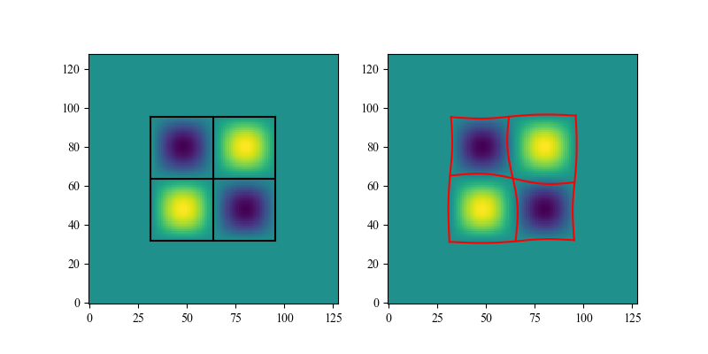

# cCartogram

Python and MATLAB wrappers for Mark Newman's C implementation of density-equalizing cartograms
using the diffusion method by [Gastner and Newman (2004)](https://doi.org/10.1073/pnas.0400280101).

<p align="center">
  
</p>

Cartograms are map projections where geographic regions are rescaled according to
some variable (e.g., population density), distorting the geometry while preserving
topology.

For more details, see the [original code website](http://www-personal.umich.edu/~mejn/cart/).

**Looking for a higher-level interface?** Check out [pycartogram](https://github.com/benmaier/pycartogram) for a more user-friendly Python API with detailed documentation and examples.

---

## Python

### Installation

> **Note:** cCartogram is not yet available on PyPI or conda-forge. Install from GitHub for now.

First install the FFTW3 library:

- **macOS**: `brew install fftw`
- **Ubuntu/Debian**: `sudo apt install libfftw3-dev`
- **Fedora**: `sudo dnf install fftw-devel`
- **conda**: `conda install -c conda-forge fftw`

Then install the package from GitHub:

```bash
pip install git+https://github.com/benmaier/cCartogram.git
```

#### Troubleshooting: macOS LC_RPATH Error

If you encounter an error like:

```
ImportError: dlopen(.../cCartogram.cpython-312-darwin.so...): tried: '...' (duplicate LC_RPATH '/some/path/lib')
```

This happens when the compiled library contains duplicate rpath entries. Fix it using `install_name_tool`:

```bash
# The .so file path is shown in the error message. Use it directly:
install_name_tool -delete_rpath '/the/duplicate/path/from/error' '/path/to/cCartogram.cpython-312-darwin.so'

# Example:
install_name_tool -delete_rpath '/Users/you/miniconda3/lib' '/Users/you/miniconda3/lib/python3.12/site-packages/cCartogram.cpython-312-darwin.so'
```

You can verify the fix worked by checking the rpaths:

```bash
otool -l /path/to/cCartogram.cpython-312-darwin.so | grep -A2 LC_RPATH
```

Alternatively, reinstall from source:

```bash
pip install --force-reinstall git+https://github.com/benmaier/cCartogram.git
```

### Quick Start

```python
import numpy as np
import cCartogram as cart

# Create a density matrix (must have positive values)
density = np.ones((128, 128))
density[32:96, 32:96] = 4.0  # Higher density region in center

# Compute the cartogram transformation
cartogram = cart.compute_cartogram(density.tolist())

# Transform some coordinates
old_coords = [(40.0, 50.0), (64.0, 64.0), (100.0, 100.0)]
new_coords = cart.remap_coordinates(old_coords, cartogram, 128, 128)

for old, new in zip(old_coords, new_coords):
    print(f"{old} -> ({new[0]:.2f}, {new[1]:.2f})")
```

### Examples

#### Transforming Grid Lines with a Sinusoidal Density

This example shows how a regular grid deforms under a sinusoidal density distribution:

```python
import numpy as np
import matplotlib.pyplot as plt
import cCartogram as cart

# Grid dimensions
xsize, ysize = 128, 128

# Create a sinusoidal density pattern in the center
half = xsize // 2
quarter = xsize // 4
density = np.ones((xsize, ysize))

for i in range(half):
    for j in range(half):
        density[quarter + i, quarter + j] = (
            2 + np.sin(i / half * 2 * np.pi) * np.sin(j / half * 2 * np.pi)
        )

# Create grid lines to visualize the transformation
line_coords = np.linspace(quarter, 3 * quarter, 100)
const_coords = quarter * np.ones_like(line_coords)

lines = (
    [(i * const_coords - 0.5, line_coords - 0.5) for i in range(1, 4)] +
    [(line_coords - 0.5, i * const_coords - 0.5) for i in range(1, 4)]
)

# Compute the cartogram
cartogram = cart.compute_cartogram(density.tolist(), offset=0.005, blur=5)

# Plot original and transformed
fig, (ax1, ax2) = plt.subplots(1, 2, figsize=(10, 5))

ax1.imshow(density.T, origin='lower')
ax1.set_title('Original density with grid')
for x, y in lines:
    ax1.plot(x, y, 'k', linewidth=1)

ax2.imshow(density.T, origin='lower')
ax2.set_title('Transformed grid')
for x, y in lines:
    coords = list(zip(x, y))
    new_coords = cart.remap_coordinates(coords, cartogram, xsize, ysize)
    new_x = [c[0] for c in new_coords]
    new_y = [c[1] for c in new_coords]
    ax2.plot(new_x, new_y, 'r', linewidth=1)

plt.tight_layout()
plt.show()
```

#### US Population Density Cartogram

Transform state boundaries according to population density:

```python
import numpy as np
import matplotlib.pyplot as plt
import cCartogram as cart

# Load population density data (rows=longitude, cols=latitude)
density = np.loadtxt('uspop.dat').T

# Find boundary pixels (where density changes)
x_diff = density[1:, :] - density[:-1, :]
y_diff = density[:, 1:] - density[:, :-1]
edge_x, edge_y = np.nonzero(x_diff)
edge_x2, edge_y2 = np.nonzero(y_diff)

# Combine all edge coordinates
coordinates = list(set(
    list(zip(edge_x.astype(float), edge_y.astype(float))) +
    list(zip(edge_x2.astype(float), edge_y2.astype(float)))
))

# Compute cartogram
print("Computing cartogram...")
cartogram = cart.compute_cartogram(density.tolist(), show_progress=True)

# Transform coordinates
print("Remapping coordinates...")
new_coords = cart.remap_coordinates(coordinates, cartogram, *density.shape)

# Plot results
fig, (ax1, ax2) = plt.subplots(2, 1, figsize=(8, 8))

ax1.imshow(np.log(density).T, origin='lower', cmap='viridis')
ax1.scatter([c[0] for c in coordinates], [c[1] for c in coordinates],
            s=0.1, c='black')
ax1.set_title('Original boundaries')

ax2.imshow(np.log(density).T, origin='lower', cmap='viridis')
ax2.scatter([c[0] for c in new_coords], [c[1] for c in new_coords],
            s=0.1, c='black')
ax2.set_title('Cartogram-transformed boundaries')

plt.tight_layout()
plt.savefig('uspop_cartogram.png', dpi=150)
plt.show()
```

### API Reference

#### `compute_cartogram(density, offset=0.005, blur=0.0, show_progress=False)`

Compute a density-equalizing cartogram transformation grid.

**Parameters:**
- `density` (list of lists of float): 2D matrix of positive density values
- `offset` (float): Small value added to avoid division by zero (default: 0.005)
- `blur` (float): Gaussian blur radius for smoothing input (default: 0.0)
- `show_progress` (bool): Print progress during computation (default: False)

**Returns:**
- List of (x, y) tuples representing the displacement grid

#### `remap_coordinates(coordinates, cartogram, xsize, ysize)`

Transform coordinates using a precomputed cartogram.

**Parameters:**
- `coordinates` (list of tuples): List of (x, y) coordinate pairs to transform
- `cartogram` (list of tuples): Displacement grid from `compute_cartogram`
- `xsize` (int): Width of the original density matrix
- `ysize` (int): Height of the original density matrix

**Returns:**
- List of transformed (x, y) coordinate tuples

---

## MATLAB

### Installation (macOS)

1. Install XCode from the App Store
2. Install FFTW3 (e.g., `brew install fftw`)
3. Edit the MEX configuration files if needed:
   ```matlab
   edit([matlabroot '/bin/maci64/mexopts/clang++_maci64.xml'])
   edit([matlabroot '/bin/maci64/mexopts/clang_maci64.xml'])
   ```
4. Update the library paths in `setup.m` if your FFTW3 installation differs from `/usr/local/lib`
5. Run the setup script from within MATLAB:
   ```matlab
   >> cd /path/to/cCartogram
   >> setup
   ```

### Quick Start

```matlab
% Create a density matrix
A = ones(100, 200);
A(20:30, 20:80) = 0.5;
A(31:50, 30:70) = 1.5;
A(51:70, 20:80) = 2.0;

% Compute cartogram
offset = 0;
blur = 0;
cart = cartogram_compute(A, offset, blur);

% Transform coordinates (MATLAB indices start at 1, algorithm at 0)
[xsize, ysize] = size(A);
coords = [50, 50; 75, 100];  % Example coordinates
new_coords = cartogram_remap_coordinates(coords - 1, cart, xsize, ysize) + 1;
```

### Examples

#### Density Blocks with Edge Detection

```matlab
% Create a density matrix with rectangular regions
A = ones(100, 200);
A(20:30, 20:80) = 0.01;
A(31:50, 30:70) = 1.1;
A(51:70, 20:80) = 1.99;

% Detect edges (boundaries between density regions)
xdiff = A(2:end, 1:end) - A(1:(end-1), 1:end);
ydiff = A(1:end, 2:end) - A(1:end, 1:(end-1));
[rowx, colx] = find(xdiff);
[rowy, coly] = find(ydiff);
edges = [rowx, colx; rowy, coly];

% Plot original density with edges
figure;
imagesc(log(A.'));
hold on;
plot(edges(:,1), edges(:,2), '.', 'MarkerSize', 0.1);

% Compute cartogram
offset = 0;
blur = 0;
cart = cartogram_compute(A, offset, blur);

% Transform edge coordinates
% Note: MATLAB indices start at 1, algorithm expects 0-based
[xsize, ysize] = size(A);
new_coords = cartogram_remap_coordinates(edges - 1, cart, xsize, ysize) + 1;

% Plot transformed edges
plot(new_coords(:,1), new_coords(:,2), 'd', 'MarkerSize', 1);
title('Original edges (dots) vs Transformed edges (diamonds)');
```

### API Reference

#### `cartogram_compute(A, offset, blur)`

Compute a cartogram from density matrix `A`.

#### `cartogram_remap_coordinates(coords, cart, xsize, ysize)`

Transform coordinates using a precomputed cartogram. Remember to subtract 1 from
MATLAB coordinates before calling and add 1 to the results.

---

More examples can be found in the `sandbox/` directory.

## License

This package contains code under two licenses:

- **Core algorithm** (cart.cpp, cartogram.cpp, etc.): BSD-3-Clause, Copyright Mark Newman
- **Python/MATLAB wrappers** (cCartogram.cpp, examples): MIT, Copyright Benjamin F. Maier

See [LICENSING_NOTES.md](LICENSING_NOTES.md) for full details.

## Citation

If you use this software, please cite the original paper:

> Gastner, M. T., & Newman, M. E. J. (2004). Diffusion-based method for producing
> density-equalizing maps. *Proceedings of the National Academy of Sciences*,
> 101(20), 7499-7504. https://doi.org/10.1073/pnas.0400280101

## References

- [Original C code by Mark Newman](http://www-personal.umich.edu/~mejn/cart/)
- [Gastner & Newman (2004) paper](https://doi.org/10.1073/pnas.0400280101)
